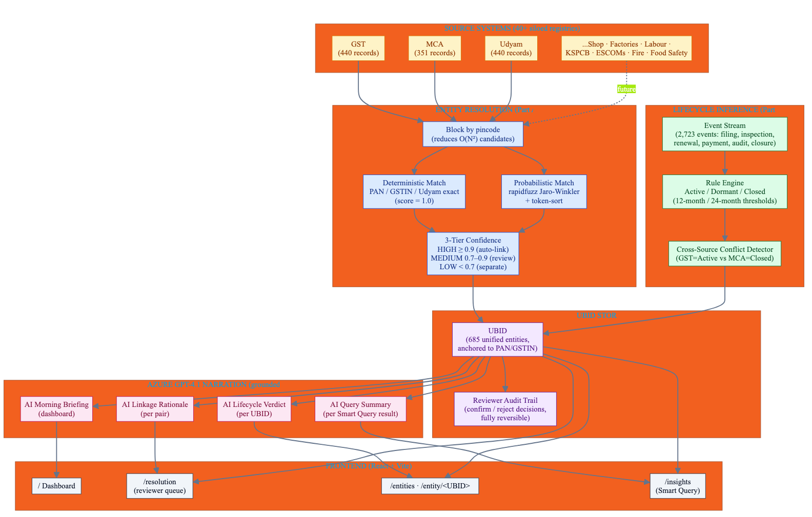

# UBID Platform — Unified Business Identifier & Active Business Intelligence for Karnataka

> **PanIIT AI for Bharat 2026 — Theme 1** · **Sponsor:** Karnataka Commerce & Industries (KCI)
> Resolve · Track · Query

▶ **[Watch the 5-minute demo](https://youtu.be/9EwGeP-IuFw)**

---

## What it solves

Karnataka's business records live in **40+ siloed department systems** — GST, MCA, Udyam, Shop Establishment, Factories, Labour, KSPCB, ESCOMs, BWSSB, Fire, Food Safety. The same business exists as different records in each one, with no reliable join key. Today the state cannot answer simple cross-department questions like *"which active factories in this pincode haven't been inspected in 18 months."* UBID closes that gap.

## Key features

- **Deterministic match** — Exact PAN / GSTIN / Udyam (score = 1.0)
- **Probabilistic match** — rapidfuzz Jaro-Winkler + token-sort, pincode blocking
- **3-tier confidence** — HIGH ≥ 0.9 (auto-link) / MEDIUM 0.7–0.9 (review) / LOW < 0.7 (separate)
- **Reviewer workflow** — Confirm / Reject pairs, decisions persisted with audit trail
- **Lifecycle inference** — Active / Dormant / Closed from cross-source event streams
- **Cross-source conflict detection** — Flags mismatches (e.g. GST=Active vs MCA=Closed)
- **Smart Query** — Runs the brief's killer query: *active factories in pincode 560058 with no inspection in 18 months* → 3 real matches
- **AI Linkage Rationale** — Azure GPT-4.1 explains every score in plain English
- **AI Lifecycle Verdict** — Grounded narration with conflict escalation

## Architecture



> Source: [`docs/diagrams/architecture.mmd`](docs/diagrams/architecture.mmd) (Mermaid)

## Quick start

### Prerequisites

| Tool | Version |
|------|---------|
| Python | 3.11+ |
| Node.js | 18+ |
| npm | 9+ |

### Backend (FastAPI on port 8000)

```bash
cd backend
python3 -m venv .venv
source .venv/bin/activate         # Windows: .venv\Scripts\activate
pip install -r requirements.txt

# Configure env (optional — without keys, AI falls back to deterministic templates)
cat > .env.local <<'EOF'
AZURE_OPENAI_API_KEY=your_key
AZURE_OPENAI_ENDPOINT=https://<resource>.openai.azure.com/openai/deployments/<deployment>/chat/completions?api-version=2025-01-01-preview
EOF

# Seed demo data + run
python ../demo/seed_demo.py
uvicorn main:app --port 8000 --reload
```

Backend on <http://127.0.0.1:8000>. OpenAPI docs at `/docs`.

### Frontend (Vite on port 5173)

```bash
cd frontend
npm install
npm run dev
```

Frontend on <http://localhost:5173> (proxies `/api` → backend port 8000).


## Demo flow

1. Land on `/` for the **AI Morning Briefing** + KPI strip + linkage funnel
2. `/resolution` — 3-tier linkage queue. Click any MEDIUM pair to expand → AI Linkage Rationale + Confirm/Reject buttons
3. `/entities` — searchable UBID list. Click any UBID for its profile
4. `/entity/<UBID>` — event timeline across GST / MCA / Udyam + AI Lifecycle Verdict
5. `/insights` — Smart Query runs the brief's killer example → 3 real matches with AI Query Summary

> **Demo data:** 1,231 raw records (440 GST · 351 MCA · 440 Udyam) → **685 unified UBIDs** · 624 review-queue pairs · 2,723 lifecycle events · 326 factories tagged

## Tech stack

| Layer | Technology |
|-------|------------|
| Backend | FastAPI + SQLAlchemy 2 + SQLite (PostgreSQL-portable) |
| Frontend | React 18 + Vite + TypeScript + Tailwind |
| Entity resolution | rapidfuzz Jaro-Winkler + token-sort, pincode blocking |
| AI / LLM | Azure OpenAI GPT-4.1 (fully optional with deterministic fallback) |
| Data | 1,231 synthetic records · ground-truth match set for accuracy validation |

## Brief non-negotiables met

- ✅ Source systems unmodified (UBID is a side-car decision-support layer)
- ✅ UBID is the only join key
- ✅ Synthetic data only (Faker seed=42, deterministic)
- ✅ All decisions explainable + reversible
- ✅ No hosted-LLM on raw PII (synthetic demo only; on-prem inference path documented)

---

## Submission

- **Hackathon:** PanIIT AI for Bharat 2026
- **Theme:** 1 — Unified Business Identifier & Active Business Intelligence for Karnataka
- **Video:** https://youtu.be/9EwGeP-IuFw
- **Repo:** https://github.com/sridhar7601/ubid-karnataka
- **Team:** Sridhar Suresh, Sruthi Krishnakumar
